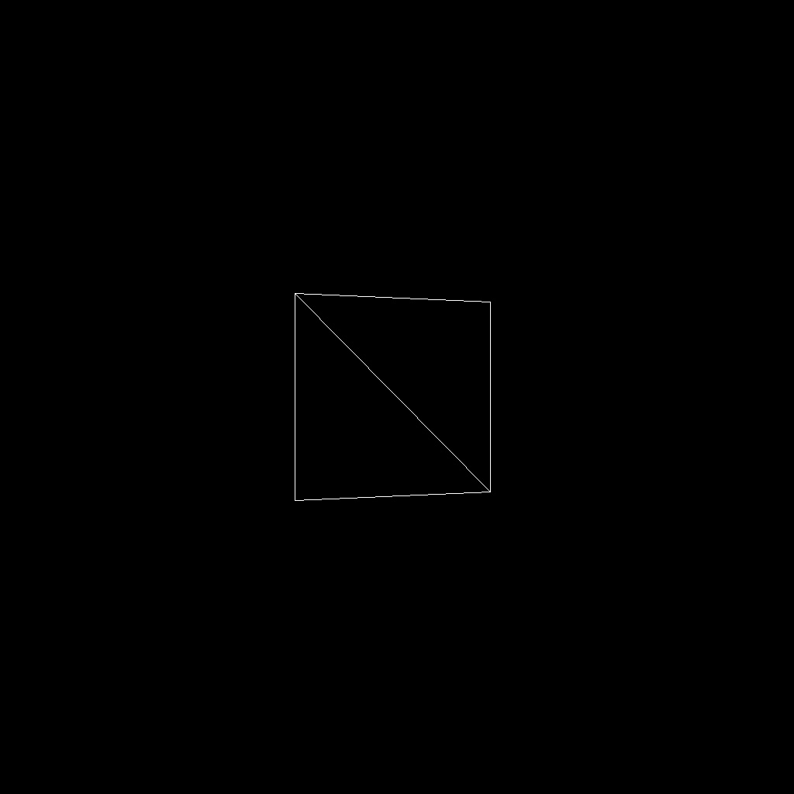
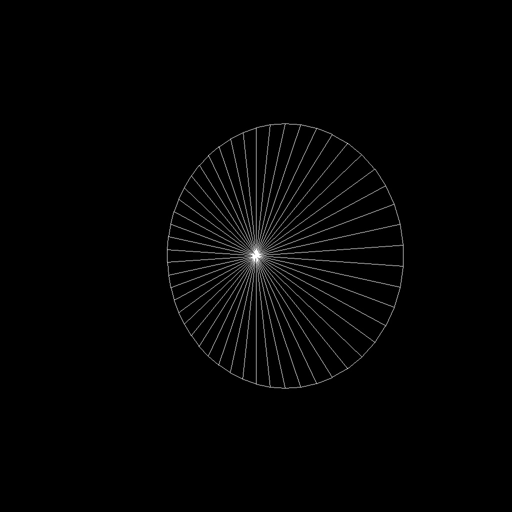
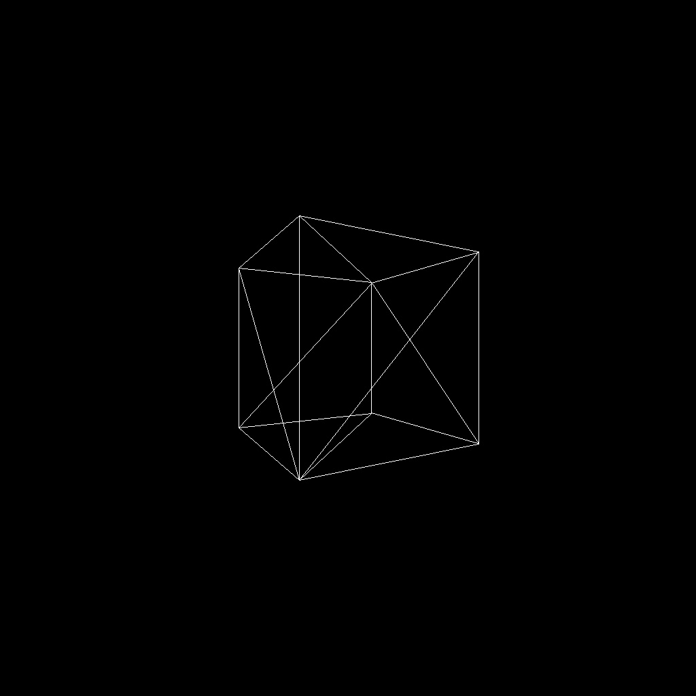
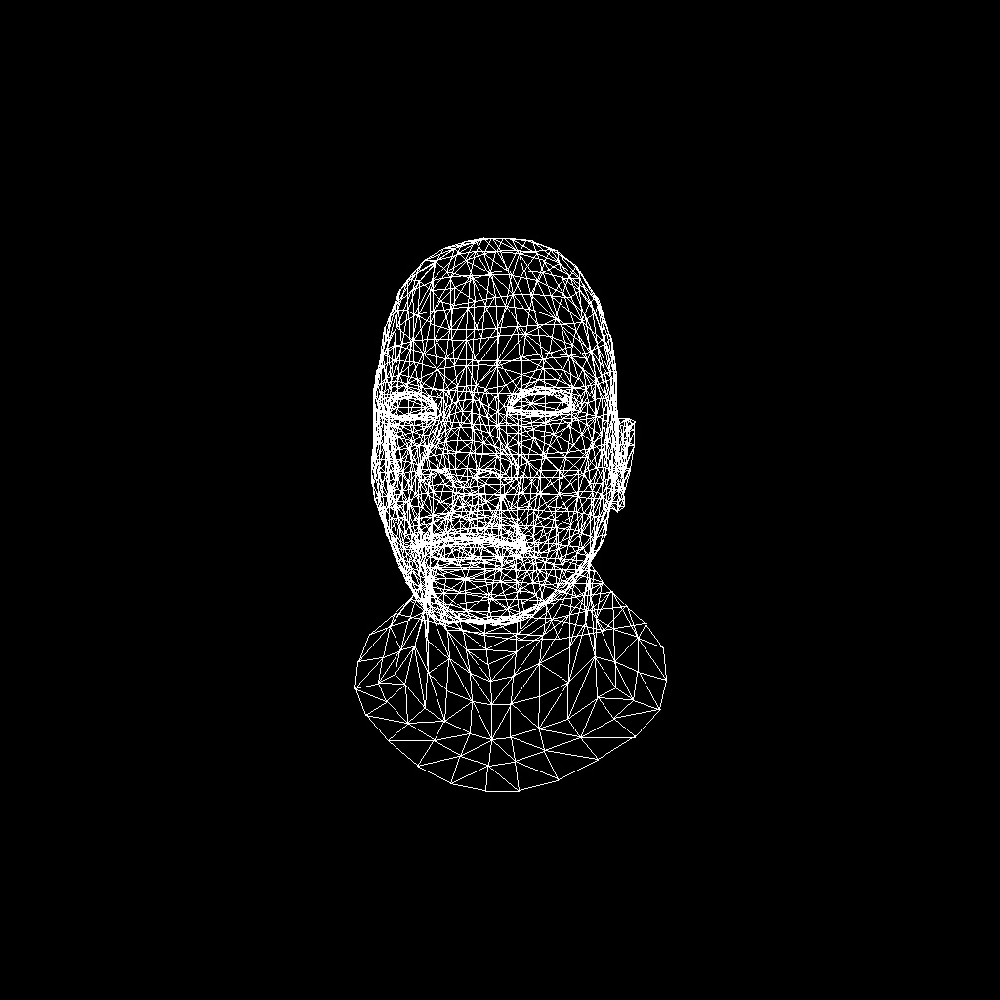
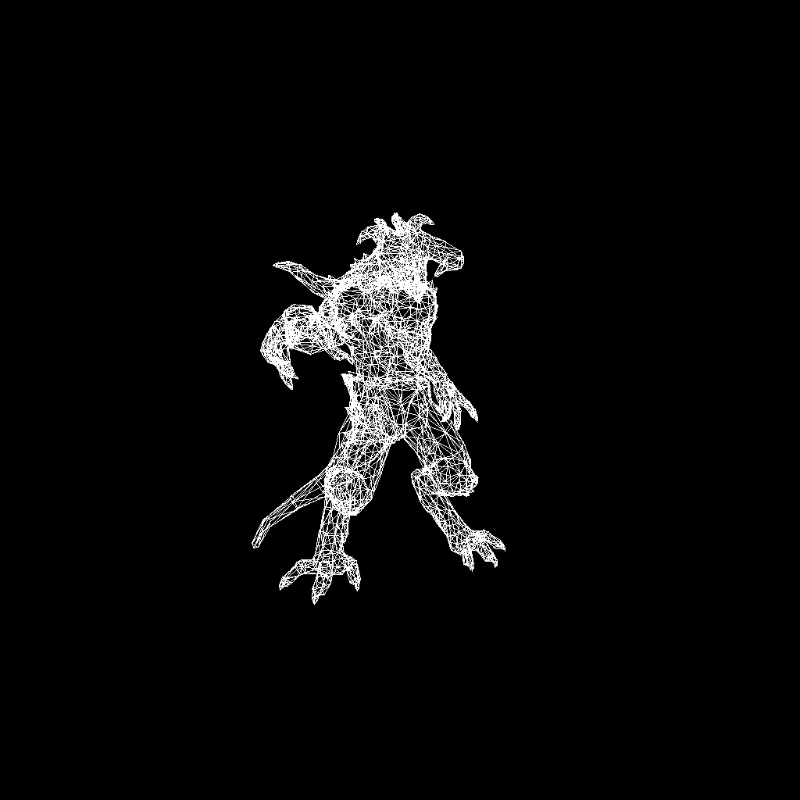

## Assignment2 Report

- In this assignment, we are asked to fullfill a renderer's module of transformation.

- The `eye_pos` defined is a point on the positive z axis. As by default camera should look at the negative direction of z axis.

- The `eye_fov = 90` is defined to be `90`. Other values could be set freely by modifying the code. Similarly:
  
  - `aspect_ratio = 1`
  - `zNear = 0.01`
  - `zFar = 100`

- In this assignment I added a small parser for `obj` file that enables this renderer to render arbitrary `obj` mesh, which greatly enhances the usablitity of this renderer.

#### Results

- Triangle
  

- Square
  

- Circle
  

- Cube
  

- African Head
  

- Diablo3 Pose
  
